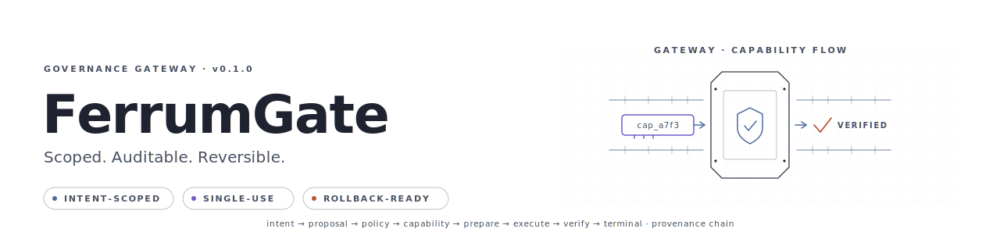
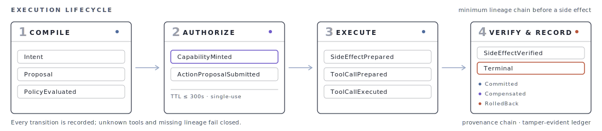

# FerrumGate

> **Scoped, Auditable, Reversible.**

[](https://github.com/BrianNguyen29/Ferrum-Gate/actions/workflows/ci.yml)
[](./LICENSE)
[](https://www.rust-lang.org/)

[English](./README.md) · [Tài liệu](./docs/README.md) · [Quickstart](./docs/guides/quickstart.md) · [Operator Guide](./docs/guides/operator.md) · [Security Model](./docs/guides/security-model.md)

<p align="center">
  
</p>

FerrumGate là một governance gateway cho AI agents, thay thế quyền truy cập công cụ thường trực (ambient authority) bằng các capability có phạm vi rõ ràng, chỉ dùng một lần — giúp mọi hành động đều được kiểm tra policy, chuẩn bị rollback và ghi lại provenance.

---

## Tại sao cần gateway?

API key truyền thống trả lời được *"ai được gọi API?"* nhưng không trả lời *"agent đang cố làm gì?"*, *"hành động này có nằm trong phạm vi không?"* hay *"có thể rollback không?"*.

FerrumGate đứng giữa agent và công cụ, đưa mỗi side effect vào một vòng đời có kiểm soát: khai báo intent, đánh giá policy, cấp capability có phạm vi, chuẩn bị rollback, thực thi, verify và ghi provenance. **Agent không nên có quyền thường trực trực tiếp trên hệ thống production.** Agent chỉ nhận quyền hẹp, ngắn hạn, giải thích được cho một hành động cụ thể, với rollback và lineage được chuẩn bị sẵn trước khi side effect xảy ra.

---

## Ba trụ cột

**Scoped** — Không có ambient authority. Mọi capability đều được ràng buộc với intent đã khai báo, tài nguyên cụ thể và TTL ≤ 300 giây. Sau khi dùng hoặc hết hạn, lease biến mất.

**Auditable** — Quyết định policy, cấp phát capability, lần thực thi và trạng thái terminal đều được ghi thành chuỗi provenance. Evidence được thiết kế theo hướng chỉ bổ sung (append-only).

**Reversible** — Rollback và recovery contract được chuẩn bị trước khi bất kỳ adapter nào thực hiện side effect. Nếu verify thất bại, hệ thống có thể compensate hoặc rollback thay vì để lại mutation dở dang.

---

## Quickstart

Yêu cầu: Rust stable, `cargo`, `make`, `curl`.

```bash
# Build và chạy gateway development
FERRUMD_BIND_ADDR=127.0.0.1:18080 \
  cargo run -p ferrumd -- --config configs/ferrumgate.dev.toml

# Kiểm tra liveness
curl http://127.0.0.1:18080/v1/healthz

# Hướng dẫn đầy đủ trong 10 phút
cat docs/guides/quickstart.md
```

> **Lưu ý:** `cargo run` chạy ở debug mode — phù hợp cho local development. Với deployment production-like, hãy dùng `cargo build --release` và chạy `./target/release/ferrumd` với production config và bearer auth.

---

## Vòng đời thực thi



Mọi hành động có mutation đều tuân theo chuỗi lineage tối thiểu: **Intent → PolicyEvaluated → CapabilityMinted → ActionProposalSubmitted → SideEffectPrepared → ToolCallPrepared → ToolCallExecuted → SideEffectVerified → Terminal state** (committed, compensated, rolled back hoặc failed). Store-backed transitions, fencing token và lineage gate ép buộc thứ tự này. Các mutating tool không rõ binding sẽ fail closed, trừ khi được ràng buộc rõ ràng.

---

## Adapter và entrypoint

FerrumGate cung cấp các adapter có boundary rõ ràng cho side effect phổ biến của agent, mỗi adapter đều có sandboxing, allowlist và rollback contract:

- **Filesystem** — ghi, xóa, di chuyển, sao chép, append, chmod, tạo/xóa thư mục với sandboxing và snapshot.
- **Git** — commit, tạo/xóa branch, tạo/xóa tag với repository-root allowlist.
- **HTTP** — mutation với client rustls, không redirect, timeout giới hạn, SSRF guard và replay recovery contract.
- **SQLite** — mutation trên SQLite file-backed với database-root allowlist và verification gate.
- **Mail draft** — vòng đời tạo/cập nhật/xóa draft với ràng buộc recipient và content. **Không gửi email.**

Entrypoint và công cụ:

- `ferrumd` — gateway daemon
- `ferrumctl` — CLI cho health, readiness, audit, policy, approvals, lifecycle outbox, backup/restore
- `ferrum-mcp-server` — MCP stdio server (mặc định, stable)
- `ferrum-migrate` — hỗ trợ migration SQLite sang PostgreSQL
- `ferrum-stress` — stress/smoke scenarios có output machine-readable
- `ferrum-tui` — terminal dashboard cho operator

---

## Trạng thái dự án

- **Stable** — intent lifecycle, policy evaluation, capability minting, rollback prepare/verify/compensate, SQLite write queue, provenance chain, bearer/scoped/OIDC/agent auth. MCP stdio server là default và stable.
- **Implemented** — filesystem, HTTP, Git, SQLite, mail draft adapter; S3 adapter (experimental); `ferrumctl` CLI; `ferrum-stress`; `ferrum-tui`; Prometheus metrics; rate limiting; Helm chart.
- **Beta** — PostgreSQL runtime (local và CI live-tested). Production HA/multi-node topology thuộc trách nhiệm của operator, không được cung cấp bởi repo này.
- **Experimental** — MCP Streamable HTTP / SSE transport.
- **Not implemented / out of scope** — multi-tenancy, managed service, gửi email, compliance certification, MCP resumability.

> **Lưu ý trung thực:** FerrumGate không phải sản phẩm HA turnkey hay chứng nhận compliance. Operator vẫn chịu trách nhiệm về deployment topology, TLS, secrets, backup, database HA và production acceptance testing.

---

## Tài liệu

Nếu mới bắt đầu, nên đọc theo thứ tự:

1. [Concepts](./docs/guides/concepts.md)
2. [Quickstart](./docs/guides/quickstart.md)
3. [Adapter Reference](./docs/guides/adapter-reference.md)
4. [Security Model](./docs/guides/security-model.md)
5. [Operator Guide](./docs/guides/operator.md)
6. [Production Notes](./docs/PRODUCTION_NOTES.md)

Tài liệu khác:

- [API Guide](./docs/guides/api.md) · [MCP Integration](./docs/guides/mcp-integration.md) · [Demo Flows](./docs/guides/demo-flows.md)
- [Policy Authoring](./docs/guides/policy-authoring.md) · [Troubleshooting](./docs/guides/troubleshooting.md)
- [FAQ](./docs/guides/faq.md) · [Roadmap](./docs/ROADMAP.md)
- [Helm Chart](./deploy/helm/ferrumgate/README.md) · [Monitoring Config](./configs/monitoring/README.md)

---

## Phát triển và validation

```bash
make fmt      # formatting
make check    # cargo check
make lint     # clippy
make test     # tests
make docs     # link validation
make validate # expanded gate
make audit    # dependency audit
make secret-scan
```

Xem [CONTRIBUTING.md](./CONTRIBUTING.md) để biết quy ước. Nếu bạn là AI assistant, xem [AGENTS.md](./AGENTS.md) để biết ràng buộc workspace và công cụ.

---

## License

[Apache-2.0](./LICENSE)
